<p align="center">
  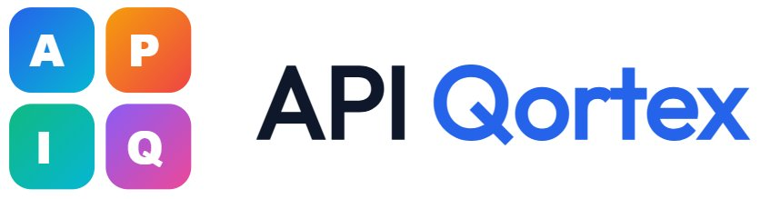
</p>

<h1 align="center">API Qortex</h1>

<p align="center">
  <strong>Self-hosted, AI-powered API testing platform</strong><br>
  Solo-built from scratch — 88,000+ lines of code
</p>

<p align="center">
  
  
  
  
  
  
</p>

<p align="center">
  <a href="https://krishnapraveen7.github.io/api-qortex">🌐 Live Landing Page</a> · 
  <a href="#screenshots">📸 Screenshots</a> · 
  <a href="#architecture">🏗 Architecture</a> · 
  <a href="#features">✨ Features</a>
</p>

---

## What is API Qortex?

A complete API testing platform that imports, executes, and AI-analyzes your API tests — running on your own server with zero cloud dependency.

Unlike tools like Postman (cloud-locked, per-seat pricing) or QA Touch (test management only, no execution), API Qortex is a **test execution platform** that actually sends requests, evaluates assertions, and uses AI to explain failures.

**Built solo by [Krishna Praveen](https://in.linkedin.com/in/krishnapraveen-m)** — QA Manager with 17+ years of experience. Not a developer by title — a quality engineer who built the tool his teams needed.

## Key Numbers

| Metric | Count |
|--------|-------|
| Lines of Code | 88,000+ |
| Engine Modules | 15 |
| React Components | 127 |
| Assertion Types | 25+ |
| AI Providers | 6 |
| API Protocols | 4 |
| Server Actions | 27 |
| Import Formats | 6 |
| Auth Types | 9 |
| RBAC Permissions | 20 |
| Plugin Hooks | 8 |
| Help Articles | 110 |

## The Problem

Most API testing tools are broken in five ways. API Qortex fixes all of them:

| Problem | How API Qortex Solves It |
|---------|--------------------------|
| **Cloud-locked & expensive** — Postman charges per seat. Enterprise plans cost thousands/year. | Self-hosted. Zero cost. Your server, your data. |
| **Tests fail with no explanation** — 401 Unauthorized. Why? Token expired? Wrong scope? You're on your own. | AI reads the response and tells you exactly why. |
| **Different tool for each protocol** — Postman for REST. GraphQL Playground for GraphQL. wscat for WebSocket. | One unified playground for all 4 protocols. |
| **No import, no migration path** — Switching tools means recreating every test from scratch. | Import from Postman, OpenAPI, HAR, cURL, Insomnia in one click. |
| **No team controls or audit trail** — Everyone has the same access. No visibility into who changed what. | 4 roles, 20 permissions, full audit log, environment isolation. |
| **No security or performance testing** — Need separate tools for load testing, security scanning, and performance baselines. | Built-in security scanner, load tester, and response time tracking. |

## Features

### 🔌 Multi-Protocol Playground
One unified workspace for **REST** (8 body types, 7 request tabs), **GraphQL** (introspection, schema explorer), **WebSocket** (real-time messaging, connection tracking), and **gRPC** (proto parser, 4 call types).

### 🤖 AI Failure Analysis
When tests fail, AI reads the full context — request, response, assertions — and returns a structured diagnosis: root cause, category, severity, and specific fix suggestion. Connected to **6 AI providers** with automatic fallback.

### ✅ 25+ Assertion Types
Status, body, JSON path, array, header, performance, and advanced checks (schema validation, regex, custom JS). Visual builder for no-code creation. Global assertion policies for org-wide quality enforcement.

### 📥 6 Smart Import Formats
Postman v2/v2.1, OpenAPI/Swagger, HAR, cURL, Insomnia, Raw JSON. Auto-detected. AI analyzes dependency chains during import and auto-configures authentication.

### 🔐 RBAC & Team Features
4 roles (Admin, Manager, Lead, Tester) with 20 granular permissions. Audit logging, environment management, SSE real-time execution, run-to-run comparison.

### 🏠 Fully Self-Hosted
No cloud subscriptions. No external service dependencies. No per-seat licensing. Single SQLite database file. Runs on any server with Node.js. Backup = copy one file.

## AI Provider Fallback Chain

```
#1 Groq  →  #2 Google AI  →  #3 OpenAI  →  #4 Anthropic  →  #5 Mistral  →  #6 Ollama
6 models     Gemini            GPT-4o        Claude           1B tkn free     Local/Unlimited
14.4K/day    1M tkn/min
```

When one provider hits its rate limit, the system automatically rotates models within that provider, then switches to the next. Ollama provides unlimited offline fallback. AI features never silently stop working.

## Screenshots

> 📸 *10 screens from the live platform — organized by user journey*

### Organize & Import

| Screenshot | Description |
|-----------|-------------|
| 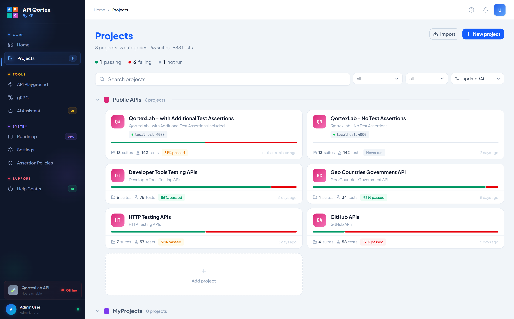 | **Projects Page** — Project grid with stats, status, quick actions |
| 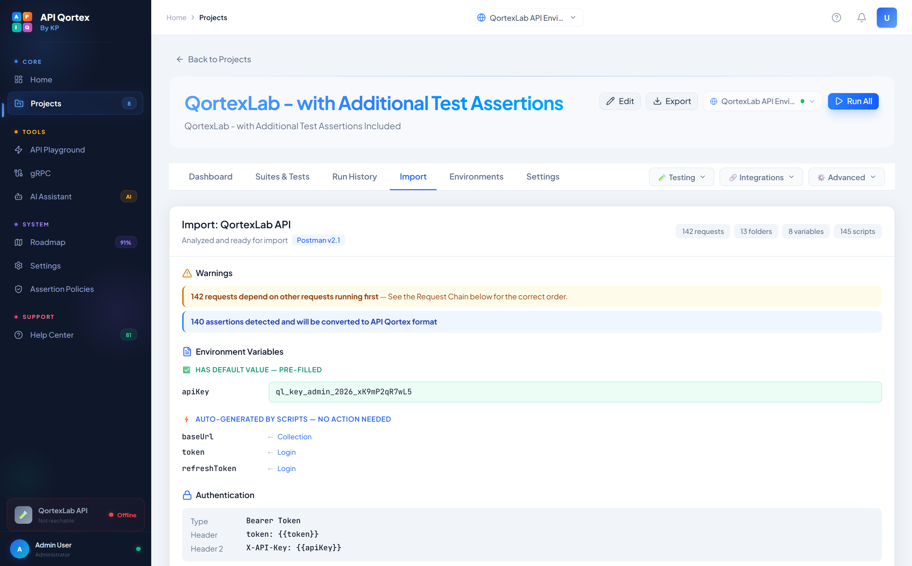 | **Smart Import** — Auto-detect format (Postman, Swagger, HAR, cURL, Insomnia), AI dependency analysis |

### Test & Execute

| Screenshot | Description |
|-----------|-------------|
| 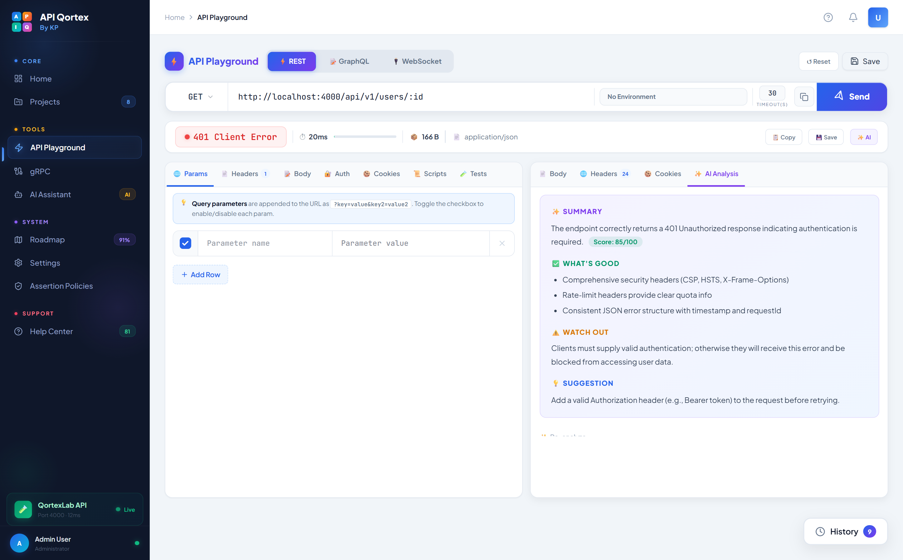 | **REST Playground** — URL bar, method pill, 7 request tabs, response panels with syntax highlighting |
| 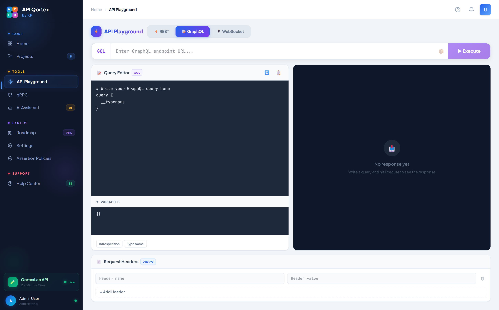 | **GraphQL Playground** — Purple-themed editor, introspection, variables panel |
| 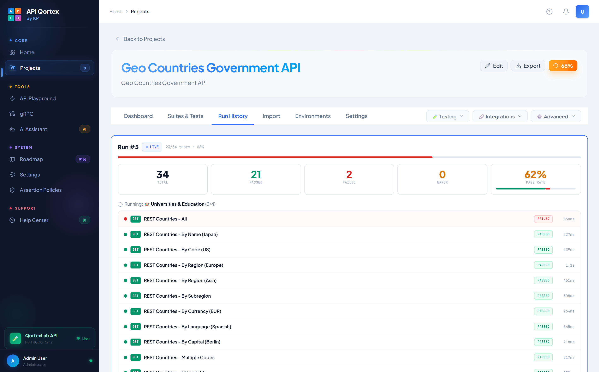 | **Test Execution Results** — Real-time SSE streaming, pass/fail indicators, timing data |

### AI Intelligence

| Screenshot | Description |
|-----------|-------------|
| 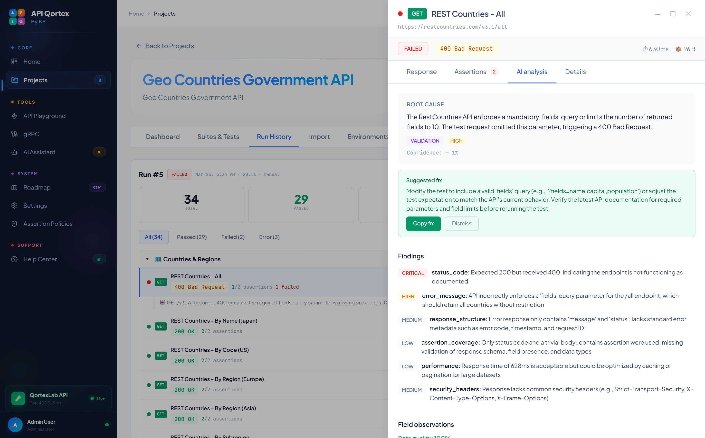 | **AI Failure Analysis** — Root cause, category, severity, specific fix suggestion |
| 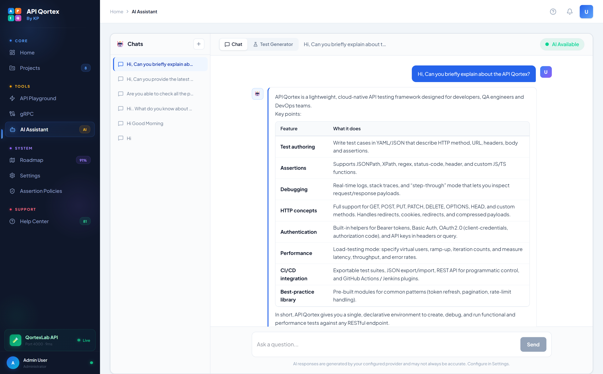 | **AI Assistant (Ask AI)** — Interactive chat for debugging help and test recommendations |

### Dashboard & Administration

| Screenshot | Description |
|-----------|-------------|
| 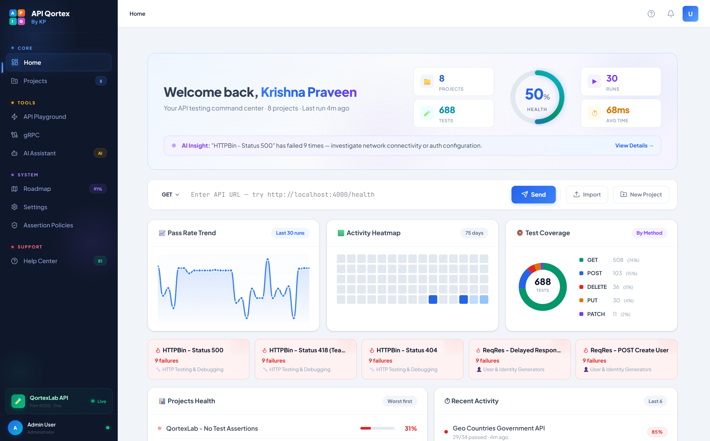 | **Home Dashboard** — Pass rate trends, response time charts, project health cards |
| 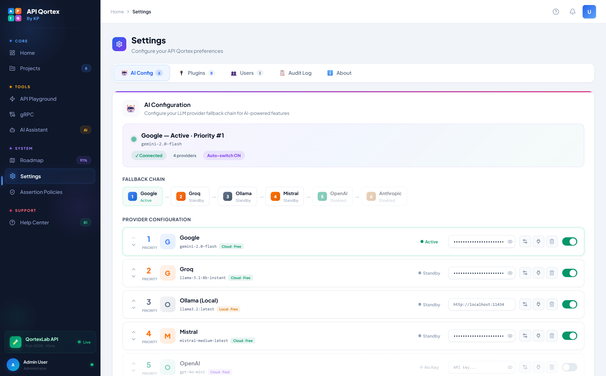 | **Settings** — AI provider chain configuration, model selection, API key management |
| 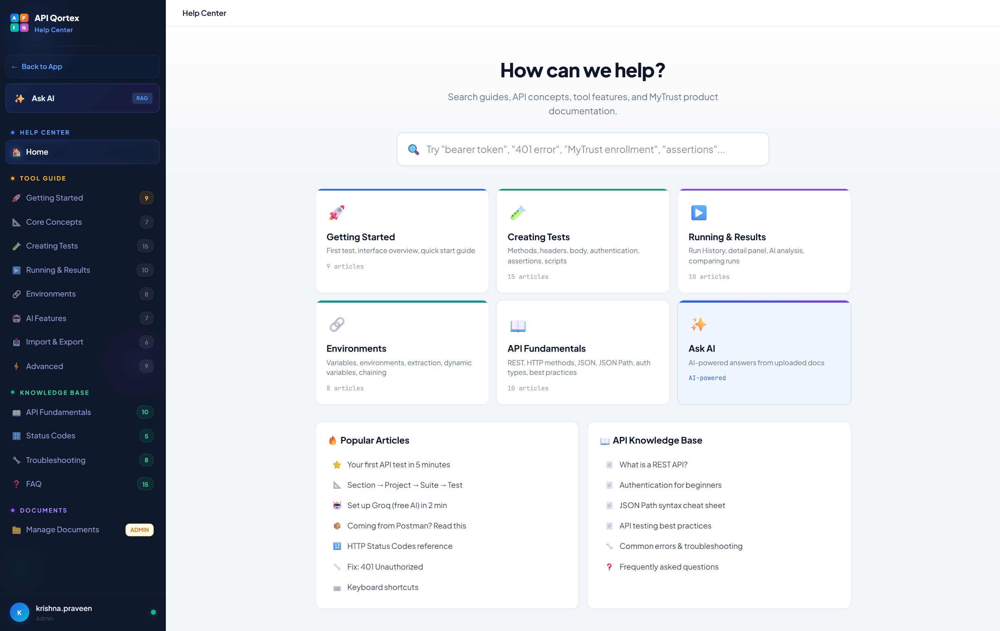 | **Help Center** — 110 articles, search, AI chat, categorized documentation |

## Architecture

```
┌─────────────────────────────────────────┐
│  Browser — React 19 + Monaco Editor     │ 127 components
│  Framer Motion, Zustand, shadcn/ui      │
└────────────────┬────────────────────────┘
                 │
┌────────────────▼────────────────────────┐
│  Server Actions — Next.js 16 RSC        │ 27 actions
│  No separate API server needed          │
└────────────────┬────────────────────────┘
                 │
┌────────────────▼────────────────────────┐
│  Engine Layer — 15 Modules              │ src/engine/
│  HTTP, assertions, auth, scripts,       │
│  GraphQL, WebSocket, import, security   │
└────────────────┬────────────────────────┘
                 │
┌────────────────▼────────────────────────┐
│  AI Service — Unified LLM Client        │ 6 providers
│  Fallback chain, streaming, native fetch│
└────────────────┬────────────────────────┘
                 │
┌────────────────▼────────────────────────┐
│  Database — Prisma 6 + SQLite           │ Single file
│  Type-safe queries, zero DevOps         │
└─────────────────────────────────────────┘
```

**Zero external services.** No Redis, no Postgres, no message queue.

## Tech Stack

| Technology | Version | Why |
|-----------|---------|-----|
| Next.js | 16.1.6 | Full-stack RSC + Server Actions = no separate API layer |
| React | 19.2.3 | Concurrent rendering, 127 components |
| TypeScript | 5 | End-to-end type safety across 286 files |
| Prisma | 6.19.2 | Type-safe ORM, auto-generated client |
| SQLite | 3.x | Single-file DB, zero DevOps |
| Tailwind CSS | 4 | Utility-first, consistent design system |
| Monaco Editor | 4.7.0 | VS Code-grade editing in browser |
| Zustand | 5.0.11 | Lightweight state management (3KB) |
| Framer Motion | 12.36.0 | Premium animations throughout UI |
| shadcn/ui | Radix | Accessible component primitives |

## 15 Engine Modules

```
src/engine/
├── http-executor.ts        # Core HTTP execution (fetch + timing)
├── assertion-evaluator.ts  # 25+ assertion types (JSONPath, regex, schema)
├── auth-resolver.ts        # 9 auth types with inheritance chain
├── script-runner.ts        # pm.* API (Postman-compatible scripting)
├── variable-resolver.ts    # {{variable}} resolution across environments
├── graphql-client.ts       # GraphQL execution + introspection
├── websocket-tester.ts     # WebSocket connection + message tracking
├── curl-parser.ts          # cURL command → structured request
├── policy-resolver.ts      # Global assertion policies (org-wide rules)
├── contract-validator.ts   # OpenAPI schema drift detection
├── security-scanner.ts     # Response security scanning
├── load-tester.ts          # Concurrent request performance testing
├── cicd-generator.ts       # GitHub Actions / GitLab CI generation
├── cli-runner.ts           # Command-line test execution
└── api-monitor.ts          # Scheduled health checks + uptime tracking
```

## Self-Hosted Advantage

| | Typical Tools | API Qortex |
|---|---|---|
| **Cost** | $15–$49/user/month | $0 forever |
| **Data** | Their cloud | Your server |
| **Features** | Tiered/gated | All included |
| **AI** | Extra cost or absent | 6 free providers |
| **Protocols** | One per tool | REST + GraphQL + WS + gRPC |
| **Team Controls** | Basic or premium-only | 4 roles, 20 permissions, audit log |
| **Security/Performance** | Separate tools needed | Built-in scanner + load tester |
| **Deployment** | Cloud only | Any server with Node.js |

## Built By

**Krishna Praveen Manchala** — QA Manager, 17+ years in quality engineering

- 🔗 [LinkedIn](https://in.linkedin.com/in/krishnapraveen-m)
- 📧 krishpravn@gmail.com

---

<p align="center">
  <strong>Self-hosted · AI-powered · Zero recurring cost</strong>
</p>
